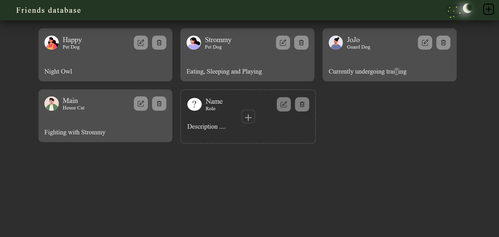
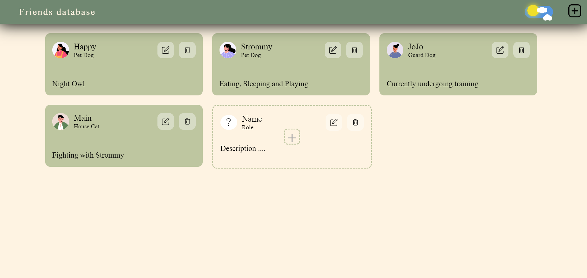
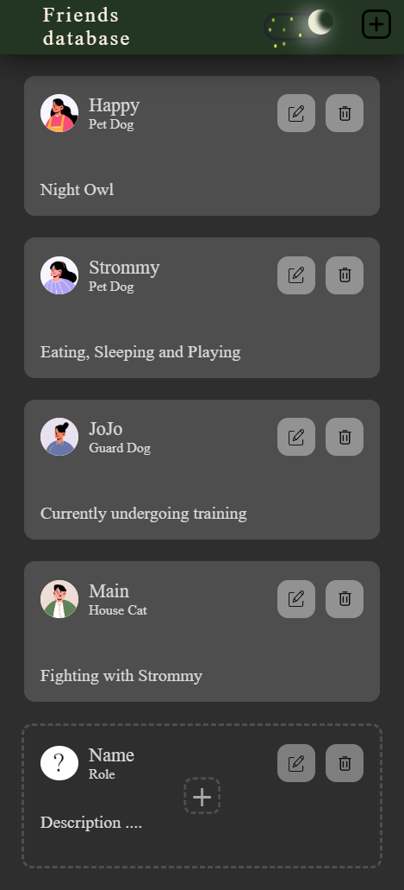
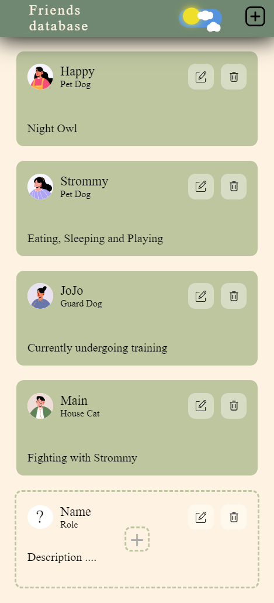

# Friend Manager
**Dynamic Web Application: Friend Manager**

This dynamic web application is built from scratch, combining the backend power of Python with Flask and the frontend flexibility of JavaScript with React. It enables users to seamlessly manage a list of friends, offering full CRUD (Create, Read, Update, Delete) functionality in a clean, responsive interface.

**Tech Stack:**
- **Python**, **Flask** (Backend)
- **React** (Frontend)
- **SQLite** (Database)
- **SQLAlchemy** (ORM)

### Key Features:
- **CRUD Functionality**: Manage friends by creating, viewing, updating, and deleting entries.
- **Virtual Environments**: Best development practices followed with virtual environments (venv) to ensure clean, isolated project dependencies.
- **Light/Dark Mode**: Toggle between light and dark modes for a customizable user experience.
- **Responsive Design**: The app is optimized for various screen sizes, from mobile phones to desktop screens, ensuring seamless usability across devices.
- **Deployment on Render**: The application is hosted and accessible through Render’s free tier.

This project highlights both functional and aesthetic aspects, ensuring a smooth, modern user experience for managing your personal friend database.

### Screen shots

        

